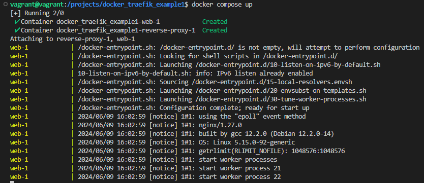
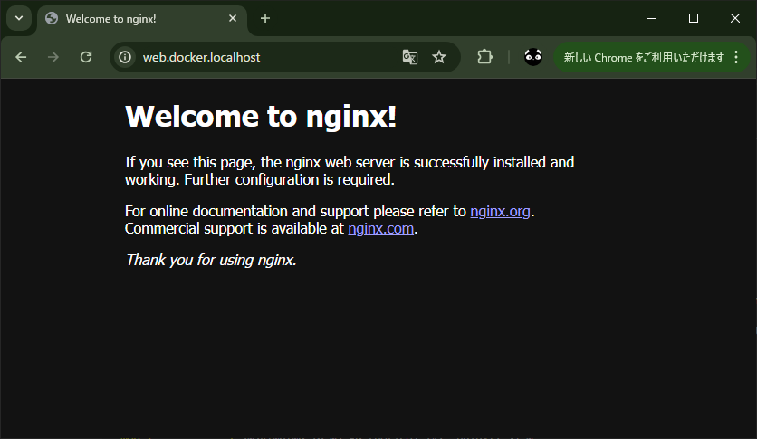

# docker_traefik_example1

traefik  
https://traefik.io/  
https://hub.docker.com/_/traefik  

クラウドネイティブなアプリケーションプロキシ Traefik を利用してみた  
https://blog.devplatform.techmatrix.jp/blog/try-cloud-native-application-proxy-traefik/  
> Traefik とは？  
Traefik （「トラフィック」と発音します）は、マイクロサービスのデプロイを容易にする最新のリバースプロキシおよびロードバランサーです。   
Traefik は、既存のインフラストラクチャコンポーネントと統合し、それ自体を自動的かつ動的に構成します。

Traefikとは｜Traefikマーシャラーになろう  
https://zenn.dev/pitekusu/books/traefik-pitekusu/viewer/about-traefik  

traefiklabs - Quick Start  
https://doc.traefik.io/traefik/getting-started/quick-start/  

## 実行

```
docker compose up
```





## TODO

### 事象

起動してからしばらくすると `Error while Peeking first byte` というエラーログが記録される。

### 発生条件（たぶん）
~~`--api.insecure=true` または `--api.dashboard=true` でダッシュボードを有効化した後、ブラウザでダッシュボードを表示して、しばらく時間が経つと発生する？~~  
ダッシュボード無効でも普通にエラー出てた。  

### 対応

調べると以下のように、いくつか記事が見つかるが解決方法はわからず。  
→　とりあえず無視で

Error while Peeking first byte read: connection timed out  
https://community.traefik.io/t/error-while-peeking-first-byte-read-connection-timed-out/21026

### ログ
v2.11.3
```
reverse-proxy-1  | time="2024-06-09T04:33:01Z" level=error msg="Error while Peeking first byte: read tcp 172.30.0.2:80->172.30.0.1:58738: i/o timeout"
```

v3.0.1
```
reverse-proxy-1  | 2024-06-09T04:36:52Z ERR Error while Peeking first byte error="read tcp 172.18.0.3:80->172.18.0.1:59838: i/o timeout"
```